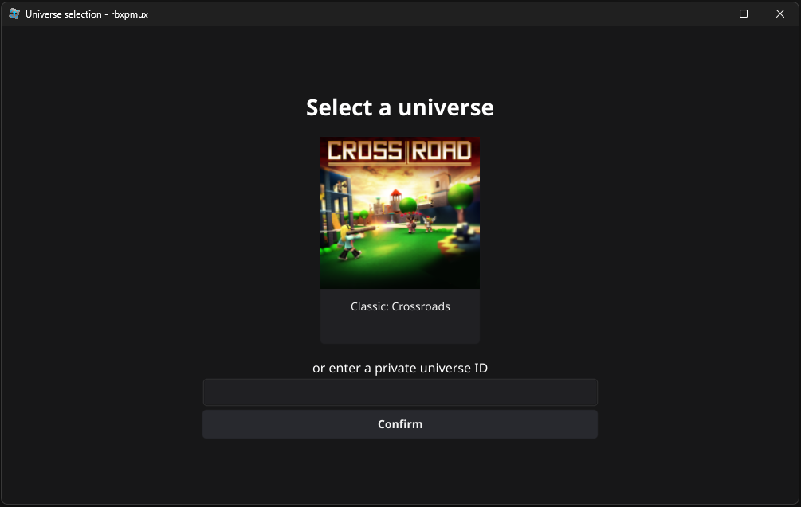
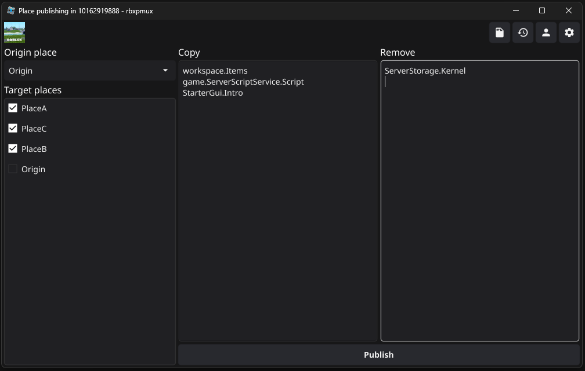

#  rbxpmux

[](https://github.com/robinskaba/rbxpmux/releases/latest)

_simplify publishing games with multiple places containing the same instances_

|  |  |
| ------------------------------------------------ | ----------------------------------------------- |

It allows you to select a single origin place and publish it to multiple target places at once. You can provide paths to specify which instances to copy or remove.

## Features

- mass copy instances from one place to multiple other places at the same time without opening Studio
- remove instances from multiple places
- load instructions from a .txt file
- keep a history of published instructions
- configurable default options for individual universes

### Instructions

Instructions are used to either copy or remove an instance. Provide a list of instance paths in the corresponding text areas, or load them from a .txt file.

Valid paths look like this:

- `game.ServerStorage.Folder`
- `game.Workspace.Models`
- `ServerScriptService.Modules` (the `game` prefix can be omitted)
- `workspace.ToolA` (the `workspace` alias works)
- `StarterGui` (entire services can be copied as one path)

The `.txt` file format is simply a list of paths separated by newlines annotated by either a `copy` or `remove` heading.

**Example file**:

```
copy
game.ServerStorage.Folder
workspace.ToolA

remove
ServerScriptService.Modules.Script
```

## Download

Download the executable for your OS from [the releases](https://github.com/robinskaba/rbxpmux/releases/latest). No other installation is necessary.
